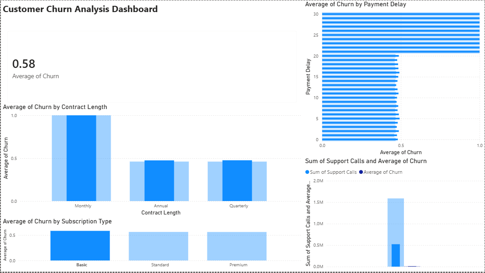
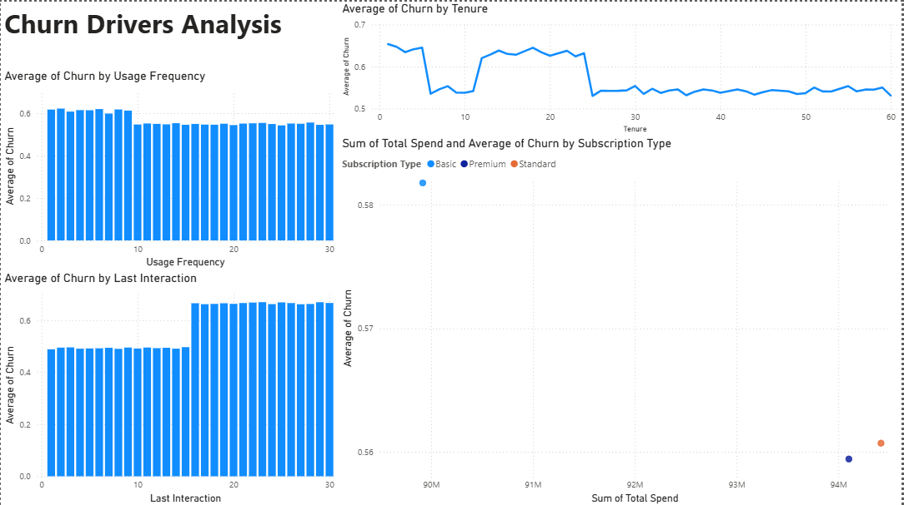
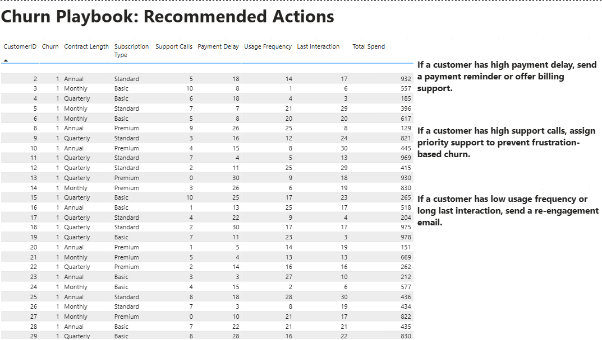

# Customer Churn Analysis Dashboard

## Project Objective

This project analyzes customer churn to understand why customers are leaving, identify churn-driving behaviors, and recommend actions the business can take to improve customer retention.

## Business Problem

The company is losing customers but does not know which customer groups are most at risk or what behaviors indicate churn. This dashboard helps answer:

- What is the overall churn rate?
- Which contract types and subscription plans have higher churn?
- Which customer behaviors are linked to churn?
- What actions should the business take to reduce churn?

## Tools Used

- Power BI
- CSV dataset
- Data visualization
- Business analysis

## Dataset

The project uses customer churn data with fields such as:

- Customer ID
- Age
- Gender
- Tenure
- Usage Frequency
- Support Calls
- Payment Delay
- Subscription Type
- Contract Length
- Total Spend
- Last Interaction
- Churn

## Dashboard Pages

### 1. Churn Overview

This page shows the overall churn rate and churn breakdowns by contract length, subscription type, support calls, and payment delay.

### 2. Churn Drivers

This page explores behavioral churn drivers such as usage frequency, tenure, total spend, and last customer interaction.

### 3. Churn Playbook

This page turns the analysis into recommended business actions for different churn risk signals.

## Key Insights

- The overall churn rate is approximately 56%.
- Monthly contract customers show higher churn risk compared with longer contract customers.
- Support calls and payment delays can act as early warning signals for churn.
- Low usage frequency and long gaps since last interaction may indicate customers who need re-engagement.

## Churn Playbook

| Risk Signal | Recommended Action |
|---|---|
| High payment delay | Send payment reminder or offer billing support |
| High support calls | Assign priority support to reduce frustration |
| Low usage frequency | Send product education or re-engagement email |
| Long last interaction | Trigger reminder campaign |
| Monthly contract | Offer annual plan discount or retention incentive |

## Business Recommendations

- Create automated reminders for customers with payment delays.
- Prioritize support for customers with repeated support calls.
- Send re-engagement campaigns to customers with low product usage.
- Focus retention offers on monthly contract customers.
- Monitor usage frequency and last interaction as leading indicators of churn.

## Final Outcome

The final Power BI dashboard provides both churn analysis and a practical retention action plan. Instead of only showing who churned, the project explains likely churn drivers and suggests business actions to reduce future customer loss.
